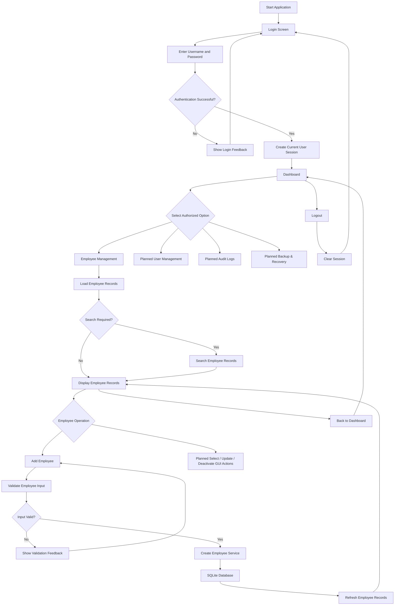

# Employee Management System — System Flow

## Purpose

This diagram represents the current application flow after the implemented authentication, session, dashboard, Employee Management, search, and Add Employee milestones.

Features not yet implemented in the GUI are explicitly marked as planned rather than shown as completed flows.

---

## Current High-Level Flow



---

## 2. Current Layered Operation Flow

```text
GUI
 ↓
Service Layer
 ↓
Validation / Business Rules
 ↓
Database Layer
 ↓
SQLite
```

For employee creation, the current flow is:

```text
Add Employee Form
       ↓
Collect Input
       ↓
validate_employee_fields()
       ↓
Valid? ── No → User Feedback
       ↓ Yes
create_employee()
       ↓
SQLite INSERT
       ↓
Commit
       ↓
Refresh Employee List
```

---

## 3. Navigation Flow

Top-level navigation is coordinated by `main.py` through callbacks.

```text
Login
  ↓
Dashboard
  ↓
Employee Management
  ↓
Back
  ↓
Dashboard
  ↓
Logout
  ↓
Login
```

---

## 4. Planned Extensions

The following flows will be documented in more detail when their implementation milestones are completed:

- User Management
- Audit Log viewing
- Backup and Recovery
- Centralized application error logging and recovery
- TQM reliability analysis workflow
